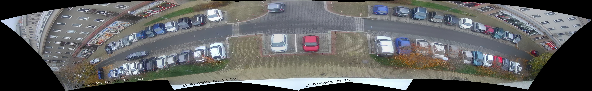
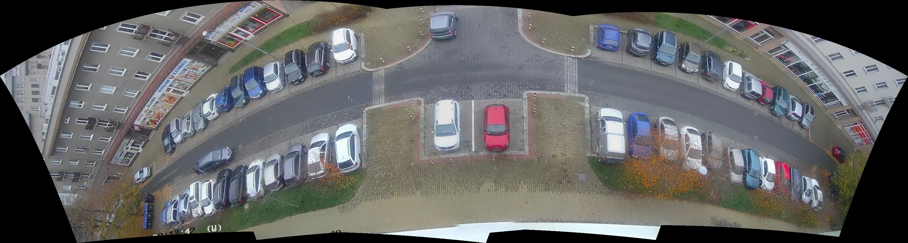
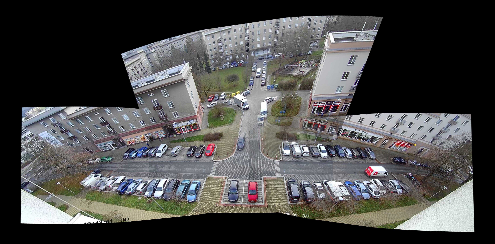
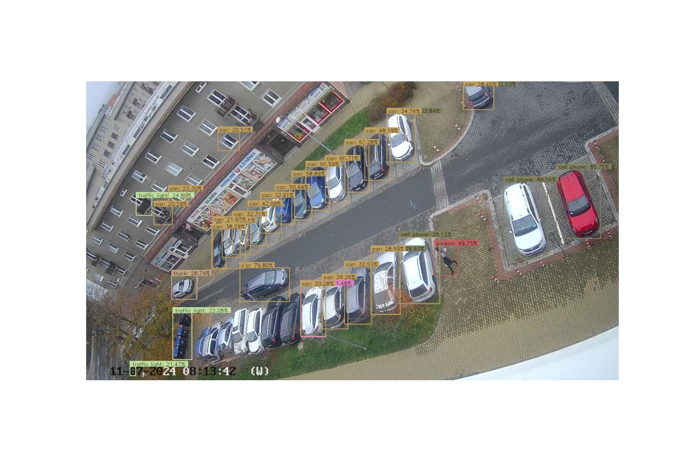
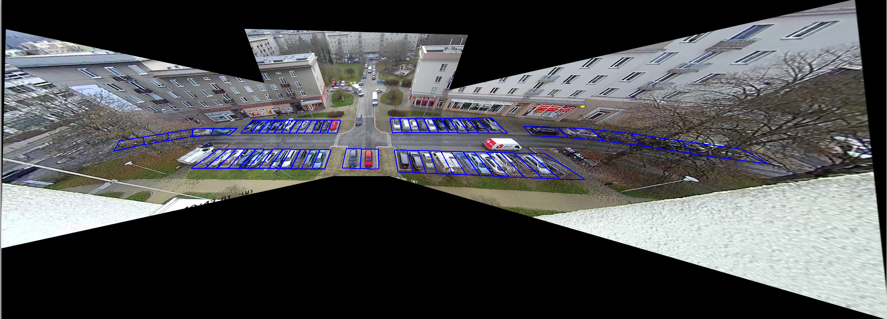
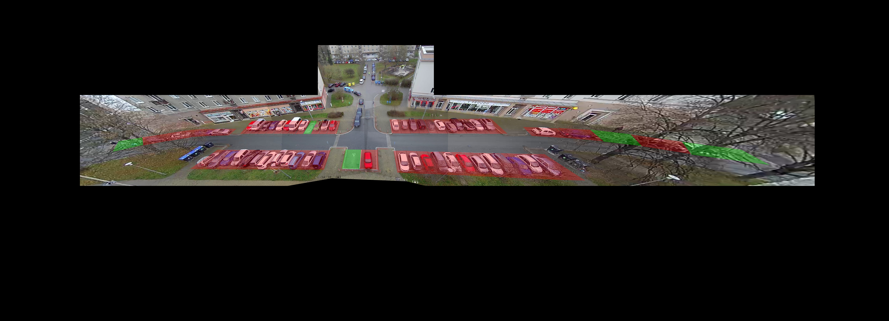

# Parking Spot Detector
This project aim is to develop an algorithm to detect available parking spots and 
inform a driver via SMS, Call or Website, where he/she can park, 
when returning home. Parking spaces are available along the street and therefore 
camera has to be rotated and more images have to be taken in order to cover the 
whole area.

## How to run
1) Clone the repo  
    `git clone https://github.com/BatekPetr/ParkingSpotDetector.git`
2) Create and activate Venv inside `pythonProject` directory:  
    `cd ParkingSpotDetector/pythonProject/`  
    `python -m venv venv`  
    `source venv/bin/activate`  
3) Install requirements.txt
    `pip install -r requirements_frozen.txt`
4) Unzip `parkslots_pano.zip`. This is zipped `.pickle` file containing template panorama and parking slots definition  
    `unzip parkslots_pano.zip parkslots_pano.pickle`
5) Run:
    - add the `pythonProject` directory to PYTHONPATH because `pythonProject` itself must be importable as a package:  
      `export PYTHONPATH=$(pwd)/..`
    - run `images_stitch_and_detect.py` script to perform stitching and detection on supplied demo images:  
      `python -m pythonProject.images_stitch_and_detect`
    - optionally specify which scenario to use with `--img` parameter:  
      `python -m pythonProject.images_stitch_and_detect --img "../imgs/testing/night_demo_3"`

## Used HW and SW
* EZVIZ Camera:
  * https://www.ezviz.com/product/c6n/9046
  * note: in order to be able to read video stream via RTSP protocol an older firmware has to be used.
  Downgrade the camera firmware following the tutorial from: https://ipcamtalk.com/threads/ezviz-disables-rtps-for-its-ip-cameras-here-is-the-fix.69927/
  * note: it is a TERRIBLE choice for project like this, see [Conclusion](#conclusion)
* PyEzviz:
  * https://pypi.org/project/pyezviz/
  * https://github.com/baqs/pyEzviz/
  * Unofficial Python package for controlling Ezviz camera implementing python-Ezviz API.
* OpenCV 4.10.0
* Python 3.12

## Project creation description
0) Find Camera intrinsic parameters for image rectification.
   * When pictures are not rectified, final panoramas are distorted and does not look pretty.
   
   * Stitching of undistorted images looks better
   
1) Create panoramic picture
   * Take several pictures while rotating the camera.
   * Undistort images.
   * Original idea was to use OpenCV Sticher class to perform stitching. 
   However, it turned out to be not suitable because Stitcher algorithm does not output homography transformations,
   which are needed to align a new panorama with parking slot template, where parking slots are defined.
   * Own stitching algorithm was developed in [MyStitching](./pythonProject/stitching/my_stitching.py) module. It offers
   following functionality:
     * Recursively stitches list of images of arbitrary length.
      *Fig: Template Panorama
     * Outputs final homogeneous transformations of individual images to the resulting panorama.
     * Buffers and transforms image keypoints to avoid unnecessary multiple computations.
     * Image warping (cylindrical and spherical) was tested to avoid Edge stretching, where objects near the edges 
     of the panorama appear larger than those in the center. 
     
     *Fig: Panorama with Spherical Warp
     As can be seen on [Pano Spherical Warp](./imgs/template_pano_spherical.jpg) warping corrects Edge stretching 
     however images are not properly stitched together. Another disadvantage of warping is that it does not 
     preserve straight lines. Having straight lines is beneficial in rectangular parking slots selection. 
     Therefore, no warping prior to stitching was performed. Warping can be applied to final panorama to slightly 
     improve the visual effect.
     * SIFT and ORB feature detection and matching was implemented (using OpenCV functions). SIFT proved to be more 
     accurate and robust in cost of longer processing time. The cost is acceptable by the usecase, so SIFT is used primarily.
     * ToDo: Image blending was not yet implemented as it is not necessary for the usecase.
2) Use Neural Network to detect parked vehicles.
   1) The first "naive" approach was to use existing pre-trained NN models. 
      * TensorFlow implementation of model [EfficientDet](https://www.kaggle.com/models/tensorflow/efficientdet/tensorFlow2/d7) 
      was initially tested. However, the model did not prove to be suitable as can be seen on the following image.
      
      * The second test was with YOLO models. The detection was not much better.
   2) This experience lead the project to the task of training a custom NN. This task required a small research to be performed 
   in order to choose suitable tools and NNs architecture.
3) Research about NN image detections
   * Before choosing one of the options, research about the topic of car detections was performed.
   * These insights were acknowledged:
     * The NNs trained on general datasets like [COCO](https://cocodataset.org/#home) are too general for the project's specific use-case.
     * [Roboflow](https://roboflow.com/) platform was found. It contains many NN models and image datasets from various use-cases.
     * [UltralyticsHub](https://www.ultralytics.com/hub) platform found. It offers seamless transfer of image datasets from Roboflow
     and is very helpful for training models. Google Colab code generation can be used for training models.
     * [Ultralytics](https://docs.ultralytics.com/) company offers implementations of YOLO NN models. 
   Implementation of YOLOv11 is in the [Python package Ultralytics](https://pypi.org/project/ultralytics/), 
   whereas older version such as YOLOv8 can be found on [Github](https://github.com/ultralytics/ultralytics/blob/main/docs/en/models/yolov8.md).
     * [Google Colab](https://colab.research.google.com/) was used for computing extensive tasks as it offers a use of GPU resources.
     * [Google Kaggle](https://www.kaggle.com) similar platform as Colab for use of GPUs for computing.
     * There are two types of NNs for object detection:
       * Multipass NNs - detection and labelling happens in 2 or more passes through NN. Due to this property, detection is usually longer but can be more precise.
       * Singlepass NNs or Single Shot Detectors (SSD) - detection and labelling happens during a single pass through NN. 
       This architecture results in faster detection for the cost of worse accuracy.
     * [Autodistill](https://docs.autodistill.com/) library can be used for auto-labelling initial images.
4) Dataset creation
   * All images where taken from the Ezviz camera
   1) For labelling initial 100 images, Autodistill library was used. GroundedDINO model was used for detections and labelling. 
   It was help-full, but detections required significant manual corrections 
   and adding box-labels for a lot of missed detections.
   2) After the first image set creation a custom model of YOLOv11x architecture was trained. This model performs much better detection than general models.
   3) Another 500 images were auto-labelled using the first custom YOLO model version. 
   The auto-labels needed to be verified and corrected. After manual corrections, data-augmentation (flipping, rotating, 
   noise addition, etc.) were added using Roboflow tools.
   4) Final dataset consisting of almost 1500 images is available on 
   [Roboflow](https://app.roboflow.com/testing-ehxhf/cardetector-kkdtp/6)
   * Big 👏👏👏 THANKS 👏👏👏 goes here to my beloved wife, who helped with manual labeling and verification!
5) Finaly YOLOv11s model was trained on Kaggle and/or Colab
6) As can be seen on gif: 
Approx. FPS of 1 and lags in video stream are not superb. But since the intention is to take images and compose panorama,
it is good enough for the usecase. Detection at night: 

Note: There are false and incorrect detections present in GIFs. It is expected as the small NN model was used. 
Accuracy improvement would be possible with the use of larger model for the cost of longer inference time.
Also, it shall be noted, that training set was heavily imbalanced with respect of Car-Truck-Person numbers.

ToDo: Add some statistics (mAP, IoU, Precision, Recall F1 Score)
7) At this point two main parts: Image Stitching and Car NN Detector were ready. The time has come to join two parts 
together. In order to be able to detect available parking spaces, they need to be defined first. In order to do this, 
a one "template" panorama was created. This panorama serves as a baseline and all new images and panoramas will be 
transformed into its coordinates. Available parking spaces were selected with the help of Ultralytics 
[Parking Management module](https://github.com/ultralytics/ultralytics/blob/main/ultralytics/solutions/parking_management.py) 
Some minor improvements like support for larger images, parking box json loading and supporting lines for drawing were 
implemented in my [parking_spot_selection module](./pythonProject/sketching/parking_spot_selection.py).
Resulting template panorama including selected parking spaces:

As can be seen, only parking spaces along the main one-way street were selected for now. Generally, it would be possible 
to select even places further away with expectation of worse detection accuracy.
8) Final result after taking new, actual images, stitching them and transforming stitched panorama into 
parking slot "template" coordinates with outlined occupied and free parking places looks like this:

9) Optimization.   
The first project result was achieved, but it took a long time to get final free space location.
Camera has to be rotated for taking pictures, features have to be detected and matched for stitching, 
NN detections must be performed. All of this can be parallelized to get result faster. When it comes to parallelization 
in python, there are two main options: multithreading and multiprocessing. Due to 
[Python GIL](https://realpython.com/python-gil/) multithreading is not a big improvement for CPU bound tasks 
(keypoints detection and matching, NN detection) since threads run "in parallel" on one CPU core waiting for each other.
On the other hand, Multiprocessing is a way to run CPU bound tasks in parallel among multiple CPU cores. 
Data synchronization between processes can be done using Multiprocessing Pipe, Queue or Locks 
(and there are more ways ...). Therefore, a combination of multiple processes and thread needed to be chosen and 
designed to use CPU resources effectively and achieve faster results.  
The slowest task is rotating the camera, there is a lot of CPU inactivity during the camera motion. 
Keypoints detection and matching and NN detections compete for CPU resources on the other side. This leads to 
a design choice for using 2 Multiprocessing processes and perform the rest of "parallelization" using 
Multithreading module. One process performs NN detections and the second one does the rest 
(camera rotation, keypoints, stitching) using multiple threads.  
ToDo: Add UML sequence diagram  
The optimized code can be found in [StitchAndDetect](./pythonProject/stitching/stitch_and_detect.py) script.
10) Vision and Deeplearning part came to an end. Of course, there are more possible improvements and code polishing, 
but the first MVP is done.
11) Next steps:
* In order to provide a triggering mechanism to the driver, server part would need to be implemented.
* Identification (e.g. numbering) of individual parking slots would have to be performed.
* Project deployment to the server would need to be done

## Conclusion
* I learned a lot about basic Computer Vision task, Stitching. I believe, that feature detection and matching, 
camera calibration can be reused in more advanced tasks like VisualSLAM.
* Exploration and application of NN detectors was also very beneficial. The task opens doors for further Deeplearning 
tasks such as Segmentation, Depth restoration, Tracking, etc.
* EZVIZ PTZ camera is a TERRIBLE choice for this task. 
  * PanTiltZoom control can be done only through EZVIZ cloud, 
  which introduces large delays, which are inconvenient for control. The camera was chosen only from the reason, 
  that I had it in my drawer from one of the previous projects.
  * To get RTSP stream, you have to downgrade firmware
  * Some API functions from PyEzviz library don't even work (e.g. Moving camera to target Y position.)